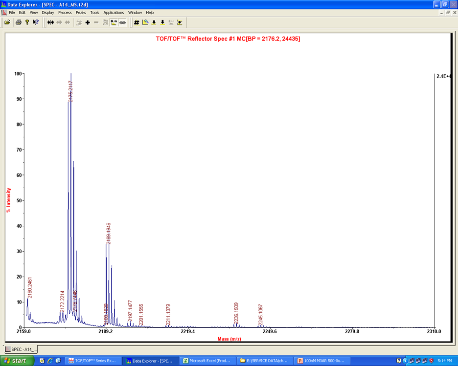
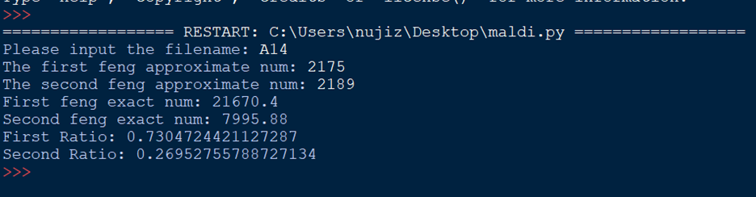

# autoMaldi

Typically, if you want to analysis a maldi TOF file (Fig. 1). Maybe most people will use ruler (measure the length) and calculator (Calculate the ratio). Maybe half a minute is required to process per figure
 
Fig. 1 Representative Maldi TOF visualization (2175: H3 peptide, 2189: me-H3 peptide)
 
More intriguingly, you can even process multiple files in less than 5 seconds. Even 1000 maldi TOF files can be processed in a blink of an eye.
 
It is absolute accurate and timesaving compared to tedious and error-prone manual calculating.
